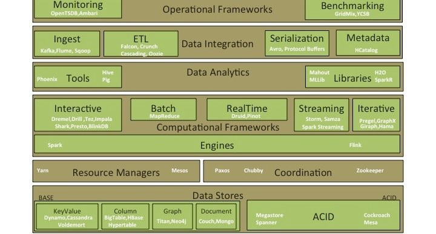

**说明：由于一些链接失效，以及我自己又新补充了些。github上面有一个repo：https://github.com/stevenlii/bigdatapaper，链接：https://www.thinkdataanalytics.com/open-source-big-data-architecture-papers**

Big Data technology has been extremely disruptive with open source playing a dominant role in shaping its evolution. While on one hand it has been disruptive, on the other it has led to a complex ecosystem where new frameworks, libraries and tools are being released pretty much every day, creating confusion as technologists struggle and grapple with the deluge.

If you are a Big Data enthusiast or a technologist ramping up (or scratching your head), it is important to spend some serious time deeply understanding the architecture of key systems to appreciate its evolution. Understanding the architectural components and subtleties would also help you choose and apply the appropriate technology for your use case. In my journey over the last few years, some literature has helped me become a better educated data professional. My goal here is to not only share the literature but consequently also use the opportunity to put some sanity into the labyrinth of open source systems.

One caution, most of the reference literature included is hugely skewed towards deep architecture overview (in most cases original research papers) than simply provide you with basic overview. I firmly believe that deep dive will fundamentally help you understand the nuances, though would not provide you with any shortcuts, if you want to get a quick basic overview.

Jumping right in…

[TOC]

# Key architecture layers

- **File Systems** - Distributed file systems which provide storage, fault tolerance, scalability, reliability, and availability.
- **Data Stores** – Evolution of application databases into [Polyglot](http://bigbe.su/lectures/2014/15.3.pdf) storage with application specific databases instead of one size fits all. Common ones are Key-Value, Document, Column and Graph.
- **Resource Managers** – provide resource management capabilities and support schedulers for high utilization and throughput.
- **Coordination** – systems that manage state, distributed coordination, consensus and lock management.
- **Computational Frameworks** – a lot of work is happening at this layer with highly specialized compute frameworks for Streaming, Interactive, Real Time, Batch and Iterative Graph (BSP) processing. Powering these are complete computation runtimes like [BDAS](http://datasys.cs.iit.edu/events/CCGrid2014/CCGrid-May25-Stoica.pdf) (Spark) & Flink.
- **Data** **Analytics** –Analytical (consumption) tools and libraries, which support exploratory, descriptive, predictive, statistical analysis and machine learning.
- **Data Integration** – these include not only the orchestration tools for managing pipelines but also metadata management.
- **Operational Frameworks** – these provide scalable frameworks for monitoring & benchmarking.

## Architecture Evolution

The modern data architecture is evolving with a goal of reduced latency between data producers and consumers. This consequently is leading to real time and low latency processing, bridging the traditional batch and interactive layers into hybrid architectures like Lambda and Kappa.

- [Lambda](https://en.wikipedia.org/wiki/Lambda_architecture) - Established architecture for a typical data pipeline. [More](http://lambda-architecture.net/) details.
- [Kappa](https://www.oreilly.com/radar/questioning-the-lambda-architecture/) – An alternative architecture which moves the processing upstream to the Stream layer.
- [SummingBird](http://www.vldb.org/pvldb/vol7/p1441-boykin.pdf) – a reference model on bridging the online and traditional processing models.

Before you deep dive into the actual layers, here are some general documents which can provide you a great background on NoSQL, Data Warehouse Scale Computing and Distributed Systems.

- [Data center as a computer](http://www.morganclaypool.com/doi/pdf/10.2200/S00516ED2V01Y201306CAC024) – provides a great background on warehouse scale computing.
- [NOSQL Data Stores](http://www.cattell.net/datastores/Datastores.pdf) – background on a diverse set of key-value, document and column oriented stores.
- [NoSQL Thesis](http://www.christof-strauch.de/nosqldbs.pdf) – great background on distributed systems, first generation NoSQL systems.  
- [Large Scale Data Management](https://homepages.inf.ed.ac.uk/wenfei/papers/JCST14.pdf) - covers the data model, the system architecture and the consistency model, ranging from traditional database vendors to new emerging internet-based enterprises.
- [Eventual Consistency](http://pages.cs.wisc.edu/~jignesh/publ/hadoopjoin.pdf) – background on the different consistency models for distributed systems.
- [CAP Theorem](https://sites.cs.ucsb.edu/~rich/class/cs293b-cloud/papers/brewer-cap.pdf) – a nice background on CAP and its evolution.

There also has been in the past a fierce debate between traditional Parallel DBMS with Map Reduce paradigm of processing. Pro [parallel DBMS](http://www.cs.umd.edu/~abadi/papers/benchmarks-sigmod09.pdf) ( [another](http://www.cs.umd.edu/~abadi/papers/mr-cacm2010.pdf) ) paper(s) was rebutted by the pro [MapReduce](http://www.cs.princeton.edu/courses/archive/spr11/cos448/web/docs/week10_reading2.pdf) one. Ironically the Hadoop community from then has come full circle with the introduction of MPI style shared nothing based processing on Hadoop - [SQL on Hadoop](http://www.vldb.org/pvldb/vol7/p1295-floratou.pdf) .

## File Systems

As the focus shifts to low latency processing, there is a shift from traditional disk based storage file systems to an emergence of in memory file systems - which drastically reduces the I/O & disk serialization cost. Tachyon and Spark [RDD](https://www.usenix.org/system/files/conference/nsdi12/nsdi12-final138.pdf) are examples of that evolution.

- [Google File System](http://static.googleusercontent.com/media/research.google.com/en/us/archive/gfs-sosp2003.pdf) - The seminal work on Distributed File Systems which shaped the Hadoop File System.
- [Hadoop File System](https://storageconference.us/2010/Papers/MSST/Shvachko.pdf) – Historical context/architecture on evolution of HDFS.
- [Ceph File System](https://ceph.com/assets/pdfs/weil-ceph-osdi06.pdf) – An [alternative](https://www.usenix.org/legacy/publications/login/2010-08/openpdfs/maltzahn.pdf) to HDFS.
- [Tachyon](https://people.csail.mit.edu/matei/papers/2014/socc_tachyon.pdf) – An in memory storage system to handle the modern day low latency data processing.

File Systems have also seen an evolution on the file formats and compression techniques. The following references gives you a great background on the merits of row and column formats and the shift towards newer nested column oriented formats which are highly efficient for Big Data processing. Erasure codes are using some innovative techniques to reduce the triplication (3 replicas) schemes without compromising data recoverability and availability.

- [Column Oriented vs Row-Stores](http://www.cs.umd.edu/~abadi/papers/abadi-sigmod08.pdf) – good overview of data layout, compression and materialization.
- [RCFile](http://web.cse.ohio-state.edu/hpcs/WWW/HTML/publications/papers/TR-11-4.pdf) – Hybrid PAX structure which takes the best of both the column and row oriented stores.
- [Parquet](https://github.com/Parquet/parquet-mr/wiki/The-striping-and-assembly-algorithms-from-the-Dremel-paper) – column oriented format first covered in Google’s Dremel’s paper.
- [ORCFile](http://web.cse.ohio-state.edu/hpcs/WWW/HTML/publications/papers/TR-14-2.pdf) – an improved column oriented format used by Hive.
- [Compression](http://www.ijritcc.org/IJRITCCVol_2Issue_3/ASurveyonCompressionAlgorithmsinHadoop.pdf) – compression techniques and their comparison on the Hadoop ecosystem.
- [Erasure Codes](http://web.eecs.utk.edu/~plank/plank/papers/Login-2013.pdf) – background on erasure codes and techniques; improvement on the default triplication on [Hadoop](http://smahesh.com/HadoopUSC/Xorbas.pdf) to reduce storage cost.

## Data Stores

Broadly, the distributed data stores are classified on ACID & BASE stores depending on the continuum of strong to weak consistency respectively. BASE further is classified into KeyValue, Document, Column and Graph - depending on the underlying schema & supported data structure. While there are multitude of systems and offerings in this space, I have covered few of the more prominent ones. I apologize if I have missed a significant one…

BASE

### Key Value Stores

[Dynamo](https://www.allthingsdistributed.com/files/amazon-dynamo-sosp2007.pdf) – key-value distributed storage system

[Cassandra](https://www.cs.cornell.edu/projects/ladis2009/papers/lakshman-ladis2009.pdf) – Inspired by Dynamo; a multi-dimensional key-value/column oriented data store.

[Voldemort](http://static.usenix.org/events/fast/tech/full_papers/Sumbaly.pdf) – another one inspired by Dynamo, developed at LinkedIn.

Column Oriented Stores

[BigTable](http://static.googleusercontent.com/media/research.google.com/en/us/archive/bigtable-osdi06.pdf) – seminal paper from Google on distributed column oriented data stores.

[HBase](http://citeseerx.ist.psu.edu/viewdoc/download%3Fdoi%3D10.1.1.303.752%26rep%3Drep1%26type%3Dpdf) – while there is no definitive paper , this provides a good overview of the technology.

[Hypertable](http://www.hypertable.com/collateral/whitepaper-hypertable-architecture.pdf) – provides a good overview of the architecture.

Document Oriented Stores

[CouchDB](https://buildmedia.readthedocs.org/media/pdf/couchdb/latest/couchdb.pdf) – a popular document oriented data store.

[MongoDB](http://s3.amazonaws.com/info-mongodb-com/MongoDB_Architecture_Guide.pdf) – a good introduction to MongoDB architecture.

### Graph

[Neo4j](https://hura.hr/wp-content/uploads/2016/10/Graph_Databases_2e_Neo4j-5.pdf) – most popular Graph database.

[Titan](http://s3.thinkaurelius.com/docs/titan/0.9.0-M2/) – open source Graph database under the Apache license.

### ACID

I see a lot of evolution happening in the open source community which will try and catch up with what Google has done – 3 out of the prominent papers below are from Google , they have solved the globally distributed consistent data store problem.

[Megastore](https://research.google/pubs/pub36971/) – a highly available distributed consistent database. Uses Bigtable as its storage subsystem.

[Spanner](http://static.googleusercontent.com/media/research.google.com/en/us/archive/spanner-osdi2012.pdf) – Globally distributed synchronously replicated linearizable database which supports SQL access.

[MESA](http://www.vldb.org/pvldb/vol7/p1259-gupta.pdf) – provides consistency, high availability, reliability, fault tolerance and scalability for large data and query volumes.

[CockroachDB](https://github.com/cockroachdb/cockroach/blob/master/docs/design.md) – An open source version of Spanner (led by former engineers) in active development.

## Resource Managers

While the first generation of Hadoop ecosystem started with monolithic schedulers like YARN, the evolution now is towards hierarchical schedulers (Mesos), that can manage distinct workloads, across different kind of compute workloads, to achieve higher utilization and efficiency.

[YARN](https://www.cse.ust.hk/~weiwa/teaching/Fall15-COMP6611B/reading_list/YARN.pdf) – The next generation Hadoop compute framework.

[Mesos](http://people.csail.mit.edu/matei/papers/2011/nsdi_mesos.pdf) – scheduling between multiple diverse cluster computing frameworks.

These are loosely coupled with schedulers whose primary function is schedule jobs based on scheduling policies/configuration.

### Schedulers

[Capacity Scheduler](https://hadoop.apache.org/docs/stable1/capacity_scheduler.pdf) - introduction to different features of capacity scheduler.

[FairShare Scheduler](http://www.valleytalk.org/wp-content/uploads/2013/03/fair_scheduler_design_doc.pdf) - introduction to different features of fair scheduler.

[Delayed Scheduling](https://www2.eecs.berkeley.edu/Pubs/TechRpts/2009/EECS-2009-55.pdf) - introduction to Delayed Scheduling for FairShare scheduler.

[Fair & Capacity schedulers](https://arxiv.org/ftp/arxiv/papers/1207/1207.0780.pdf) – a survey of Hadoop schedulers.

### 

## Coordination

These are systems that are used for coordination and state management across distributed data systems.

[Paxos](https://www.microsoft.com/en-us/research/publication/paxos-made-simple/) – a simple version of the [classical](https://www.microsoft.com/en-us/research/publication/part-time-parliament/) paper; used for distributed systems consensus and coordination.

[Chubby](http://static.googleusercontent.com/media/research.google.com/en/us/archive/chubby-osdi06.pdf) – Google’s distributed locking service that implements Paxos.

[Zookeeper](https://www.usenix.org/legacy/event/usenix10/tech/full_papers/Hunt.pdf) – open source version inspired from Chubby though is general coordination service than simply a locking service

### 

## Computational Frameworks

The execution runtimes provide an environment for running distinct kinds of compute. The most common runtimes are

[Spark](https://www.usenix.org/system/files/login/articles/zaharia.pdf) – its popularity and adoption is challenging the traditional Hadoop ecosystem. 

[Spark RDD](https://www.usenix.org/system/files/conference/nsdi12/nsdi12-final138.pdf)

[Flink](http://events.linuxfoundation.org/sites/events/files/slides/flink_apachecon_small.pdf) – very similar to Spark ecosystem; strength over Spark is in iterative processing.

The frameworks broadly can be classified based on the model and latency of processing

### Batch

[MapReduce](http://static.googleusercontent.com/media/research.google.com/en/us/archive/mapreduce-osdi04.pdf) – The seminal paper from Google on MapReduce.

[MapReduce Survey](https://www2.cs.arizona.edu/~bkmoon/papers/sigmodrec11.pdf) – A dated, yet a good paper; survey of Map Reduce frameworks.

### Iterative (BSP)

[Pregel](http://kowshik.github.io/JPregel/pregel_paper.pdf) – Google’s paper on large scale graph processing

[Giraph](https://link.springer.com/book/10.1007/978-3-319-47431-1) - large-scale distributed Graph processing system modelled around Pregel

[GraphX](https://amplab.cs.berkeley.edu/wp-content/uploads/2014/02/graphx.pdf) - graph computation framework that unifies graph-parallel and data parallel computation.

[Hama](http://csl.skku.edu/papers/CS-TR-2010-330.pdf) - general BSP computing engine on top of Hadoop

[Open source graph processing](http://www.vldb.org/pvldb/vol7/p1047-han.pdf) survey of open source systems modelled around Pregel BSP.

### Streaming

[Stream Processing](https://www.researchgate.net/publication/266660592_Survey_of_real-time_processing_systems_for_big_data) – A great overview of the distinct real time processing systems

[Storm](https://cs.brown.edu/courses/cs227/archives/2015/papers/ss-storm.pdf) – Real time big data processing system

[Samza](http://www.jfokus.se/jfokus15/preso/ApacheSamza.pdf) - stream processing framework from LinkedIn

[Spark Streaming](http://people.csail.mit.edu/matei/papers/2013/sosp_spark_streaming.pdf) – introduced the micro batch architecture bridging the traditional batch and interactive processing.

### Interactive

[Dremel](https://research.google/pubs/pub36632/) – Google’s paper on how it processes interactive big data workloads, which laid the groundwork for multiple open source SQL systems on Hadoop.

[Impala](http://cidrdb.org/cidr2015/Papers/CIDR15_Paper28.pdf) – MPI style processing on make Hadoop performant for interactive workloads.

[Drill](https://cwiki.apache.org/confluence/display/incubator/DrillProposal) – A open source implementation of Dremel.

[Shark](http://www.cs.berkeley.edu/~matei/papers/2012/sigmod_shark_demo.pdf) – provides a good introduction to the data analysis capabilities on the Spark ecosystem.

[Shark](http://people.csail.mit.edu/matei/papers/2013/sigmod_shark.pdf) – another great paper which goes deeper into SQL access.

[Dryad](http://www.news.cs.nyu.edu/~jinyang/sp07/papers/dryad.pdf) – Configuring & executing parallel data pipelines using DAG.

[Tez](https://web.eecs.umich.edu/~mosharaf/Readings/Tez.pdf) – open source implementation of Dryad using YARN.

[BlinkDB](https://sameeragarwal.github.io/blinkdb_eurosys13.pdf) - enabling interactive queries over data samples and presenting results annotated with meaningful error bars

### RealTime

[Druid](http://static.druid.io/docs/druid.pdf) – a real time OLAP data store. Operationalized time series analytics databases

[Pinot](https://github.com/linkedin/pinot/wiki/Architecture) – LinkedIn OLAP data store very similar to Druid.

### 

## Data Analysis

The analysis tools range from declarative languages like SQL to procedural languages like Pig. Libraries on the other hand are supporting out of the box implementations of the most common data mining and machine learning libraries.

### Tools

[Pig](http://infolab.stanford.edu/~olston/publications/sigmod08.pdf) – Provides a good overview of Pig Latin.

[Pig](http://paperhub.s3.amazonaws.com/a7b584c04b61fabb8d10333e91989120.pdf) – provide an introduction of how to build data pipelines using Pig.

[Hive](http://infolab.stanford.edu/~ragho/hive-icde2010.pdf) – provides an introduction of Hive.

[Hive](http://www.vldb.org/pvldb/vol2/vldb09-938.pdf) – another good paper to understand the motivations behind Hive at Facebook.

[Phoenix](http://phoenix.apache.org/presentations/OC-HUG-2014-10-4x3.pdf) – SQL on Hbase.

[Join Algorithms for Map Reduce](http://www.ispras.ru/proceedings/docs/2012/23/isp_23_2012_285.pdf) – provides a great introduction to different join algorithms on Hadoop.

[Join Algorithms for Map Reduce](http://grail.csuohio.edu/~sschung/cis612/hadoopjoin_sigmod2010.pdf) – another great paper on the different join techniques.

### Libraires

[MLlib](http://stanford.edu/~rezab/sparkworkshop/slides/xiangrui.pdf) – Machine language framework on Spark.

[SparkR](https://cs.stanford.edu/~matei/papers/2016/sigmod_sparkr.pdf) – Distributed R on Spark framework.

[Mahout](https://www.manning.com/books/mahout-in-action) – Machine learning framework on traditional Map Reduce.

## Data Integration

Data integration frameworks provide good mechanisms to ingest and outgest data between Big Data systems. It ranges from orchestration pipelines to metadata framework with support for lifecycle management and governance.

### Ingest/Messaging

[Flume](https://blogs.apache.org/flume/entry/flume_ng_architecture) – a framework for collecting, aggregating and moving large amounts of log data from many different sources to a centralized data store.

[Sqoop](https://cwiki.apache.org/confluence/download/attachments/27361435/Cecho_Ting_SqoopBigDataTechCon.pdf%3Fversion%3D1%26modificationDate%3D1366107169000%26api%3Dv2) – a tool to move data between Hadoop and Relational data stores.

[Kafka](https://www.microsoft.com/en-us/research/wp-content/uploads/2017/09/Kafka.pdf) – distributed messaging system for data processing

### ETL/Workflow

[Crunch](http://events17.linuxfoundation.org/sites/events/files/slides/Simplifying%20Big%20Data%20with%20Apache%20Crunch.pdf) – library for writing, testing, and running MapReduce pipelines.

[Falcon](http://public-repo-1.hortonworks.com/HDP-LABS/Projects/Falcon/2.0.6.0-76/FalconHortonworksTechnicalPreview.pdf) – data management framework that helps automate movement and processing of Big Data.

[Cascading](http://smokinn.com/files/cascading_notes/cascading.pdf) – data manipulation through scripting.

[Oozie](http://oozie.apache.org/docs/4.2.0/index.html) – a workflow scheduler system to manage Hadoop jobs.

### Metadata

[HCatalog](https://cwiki.apache.org/confluence/display/Hive/HCatalog%2BUsingHCat) - a table and storage management layer for Hadoop.

### Serialization

[ProtocolBuffers](http://homepages.lasige.di.fc.ul.pt/~vielmo/notes/2014_02_12_smalltalk_protocol_buffers.pdf) – language neutral serialization format popularized by Google.

[Avro](http://mil-oss.org/resources/mil-oss-wg3_an-introduction-to-apache-avro_douglas-creager.pdf) – modeled around Protocol Buffers for the Hadoop ecosystem.

## Operational Frameworks

Finally the operational frameworks provide capabilities for metrics, benchmarking and performance optimization to manage workloads.

### Monitoring Frameworks

[OpenTSDB](http://opentsdb.net/overview.html) – a time series metrics systems built on top of HBase.

[Ambari](https://issues.apache.org/jira/secure/attachment/12559939/Ambari_Architecture.pdf) - system for collecting, aggregating and serving Hadoop and system metrics

### Benchmarking

[YCSB](http://research.ijais.org/volume7/number8/ijais14-451229.pdf) – performance evaluation of NoSQL systems.

[GridMix](https://hadoop.apache.org/docs/stable1/gridmix.pdf) – provides benchmark for Hadoop workloads by running a mix of synthetic jobs

[Background](http://arxiv.org/ftp/arxiv/papers/1402/1402.5194.pdf) on big data benchmarking with the key challenges associated.

# Summary

I hope that the papers are useful as you embark or strengthen your journey. I am sure there are few hundred more papers that I might have inadvertently missed and a whole bunch of systems that  I might be unfamiliar with - apologies in advance as don’t mean to offend anyone though happy to be educated…